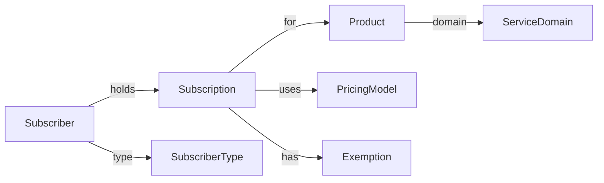

# Generic Subscription Model

## Overview

This concept defines a reusable subscription model that applies across healthcare, broadcast fees, and commercial subscription businesses. It centralizes subscriber identity, product definition, pricing models, and exemption/reduction handling while allowing each regulatory domain to enforce its own rules.

---

## Core Concepts

| Concept | Description |
|---------|-------------|
| Subscriber | Person, Household, or Organization that holds a subscription |
| Subscription | Contractual obligation to pay for a product |
| Product | What is subscribed to (insurance product, broadcast fee, telecom plan) |
| PricingModel | How prices are calculated (fixed, tiered, usage-based, promotional) |
| Exemption/Reduction | Fee waiver or discount based on rules or promotions |

---

## Pricing Models

| Model | Description | Examples |
|-------|-------------|----------|
| FIXED | Same price for all subscribers | Broadcast household fee |
| TIERED | Price depends on a tier | Broadcast corporate fee (turnover tiers) |
| REGION_AGE | Price varies by region and age | Healthcare premiums |
| USAGE_BASED | Pay per unit of use | Telecom data/roaming |
| PROMOTIONAL | Time-limited discounts | Introductory offers |
| COMPOSITE | Combination of the above | Bundled services |

---

## Cross-Domain Mapping

| Generic | Healthcare (KVG/VVG) | Broadcast Fee (RTVG) | Telecom |
|--------|-----------------------|----------------------|---------|
| Subscriber | Person | Household / Organization | Person / Organization |
| Subscription | Policy + Coverage | BroadcastSubscription | Service Contract |
| Product | Insurance product + tariff | Broadcast fee product | Plan + add-ons |
| PricingModel | Region + Age + Franchise | Fixed / Tiered | Fixed + Usage |
| Exemption/Reduction | Premium subsidy | EL / deaf-blind / diplomatic | Promotions, discounts |

---

## Domain Abstraction Diagram

---

## Notes

- Domain-specific rules (e.g., franchise, cost sharing, broadcast exemptions) stay within their respective domain modules.
- The generic model ensures shared billing, payments, and exemption handling across regulated services.

---

## Regulatory Sources

- Healthcare (KVG/VVG): https://www.bag.admin.ch/bag/en/home/versicherungen/krankenversicherung.html
- Broadcast (RTVG/BAKOM): https://www.bakom.admin.ch/bakom/en/homepage/electronic-media/radio-and-television-fee.html
- Broadcast fees (Serafe): https://www.serafe.ch/en/the-fee/fee-overview/
- Broadcast corporate fees (ESTV): https://www.estv.admin.ch/estv/en/home/federal-taxes/corporate-fee-for-radio-and-television.html

---

*Last Updated: 2026-01-28*
